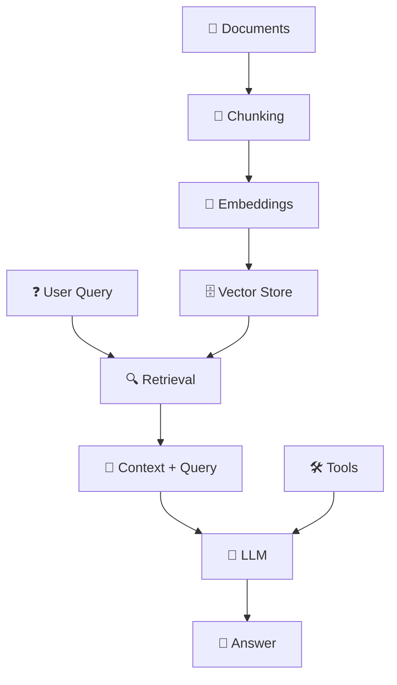

# 📚 Open RAG Template

[](https://python.org)
[](https://langchain.com)
[](https://streamlit.io)
[](LICENSE)

> **A production-ready, modular RAG framework that lets you instantly chat with your documents**

Open RAG Template is a plug-and-play Retrieval-Augmented Generation (RAG) framework built with LangChain. It lets you instantly chat with your own documents (PDF, Markdown, CSV, text, etc.) — while showcasing best practices in prompt engineering, retrieval design, agents, evaluation, and fine-tuning.

## ⚡️ Why this project?

Most RAG tutorials are toy-level. This repo gives you a production-ready, modular, open-source template you can actually use, extend, and learn from.

## ✨ Features

| Feature | Description |
|---------|-------------|
| 📂 **Multi-format ingestion** | PDF, Markdown, TXT, CSV loaders out of the box |
| 🔎 **Advanced retrieval** | FAISS vector store (default) + hybrid search + metadata filtering |
| 🧩 **Prompt engineering** | Well-structured system/user prompts with context injection |
| 🤖 **Agent mode** | SQL queries, calculator, and web search tools included |
| 📊 **Evaluation harness** | Test factuality, relevance, and grounding with LLM-based metrics |
| 🎛️ **Configurable** | Easily adjust chunk sizes, embedding models, and retrieval settings |
| 🚀 **Deploy anywhere** | Run locally (Docker, pip) or in the cloud (AWS/GCP) |

## 🖼️ Demo

<p align="center">  </p>

### Quick Start

Chat with your own PDF in 3 steps:

```bash
# 1. Clone the repository
git clone https://github.com/your-username/open-rag-template.git
cd open-rag-template

# 2. Install dependencies
pip install -r requirements.txt

# 3. Set your OpenAI API key
export OPENAI_API_KEY="your-api-key-here"

# 4. Run the app
streamlit run src/app.py
```

Then open **http://localhost:8501** 🎉

## 🏗️ Architecture

<p align="center">  </p>



### Process Flow

1. **📄 Ingest** → Documents are chunked and embedded into FAISS (or another DB)
2. **🔍 Retrieve** → Relevant chunks are retrieved per query
3. **📝 Construct** → Prompt is built with query + context
4. **🤖 Generate** → Answer is generated with an LLM (OpenAI, Anthropic, Llama 3, etc.)
5. **🛠️ Agent** → (Optional) Use tools like SQL or web search if needed
6. **📊 Evaluate** → Outputs are evaluated with metrics + logs

## 📂 Project Structure

```
open-rag-template/
├── src/
│   ├── loaders.py          # 📄 PDF/Markdown/CSV loaders
│   ├── embeddings/         # 🧠 Vectorstore + retriever setup
│   │   └── retriever.py
│   ├── prompts/            # 📝 Prompt templates
│   │   └── rag_prompt.py
│   ├── chains/             # ⛓️ RAG chain logic
│   │   └── rag_chain.py
│   ├── agent.py            # 🤖 Agent + tools (SQL, search, calculator)
│   ├── tools.py            # 🛠️ Agent tools
│   ├── evaluation.py       # 📊 Evaluation harness
│   └── app.py              # 🚀 Streamlit entrypoint
├── requirements.txt        # 📦 Dependencies
├── .gitignore             # 🚫 Git ignore rules
└── README.md              # 📖 This file
```

## 🛠️ Installation

### Requirements

- Python 3.9+
- `pip install -r requirements.txt`
- (Optional) Docker + docker-compose

### Setup

```bash
# Clone repo
git clone https://github.com/your-username/open-rag-template.git
cd open-rag-template

# Install dependencies
pip install -r requirements.txt

# Set your OpenAI API key
export OPENAI_API_KEY="your-api-key-here"

# Run app
streamlit run src/app.py
```

> **Note:** Make sure you have a valid OpenAI API key. You can get one from [OpenAI's website](https://platform.openai.com/api-keys).

## ⚡ Usage

### 📄 Document Upload

The app supports multiple document formats:

| Format | Extension | Description |
|--------|-----------|-------------|
| PDF | `.pdf` | Research papers, reports, books |
| Text | `.txt` | Plain text documents |
| Markdown | `.md` | Documentation, notes |
| CSV | `.csv` | Structured data |

### 🚀 Running the App

```bash
# Start the Streamlit app
streamlit run src/app.py
```

### 🤖 Interaction Modes

#### 1. **RAG Chain Mode** (Default)
- Simple question-answering with document context
- Automatic citation of sources
- Best for straightforward Q&A

#### 2. **RAG Agent Mode** (Advanced)
- Uses LangChain agents with tools
- Can perform complex reasoning
- Access to additional tools (search, calculator, etc.)

### ⚙️ Configuration

Key settings you can adjust:

```python
# Model selection
model_name = "gpt-4o-mini"  # or "gpt-4o", "gpt-3.5-turbo"

# Retrieval settings
top_k = 3  # Number of documents to retrieve

# Agent mode
ENABLE_AGENT_MODE = True  # Enable advanced agent features
```

## 🧪 Evaluation

### 📊 Built-in Evaluation Tools

The app includes evaluation capabilities to test your RAG system:

```bash
# Run evaluation suite
python src/evaluation.py
```

### 📈 Metrics Tracked

| Metric | Description | Purpose |
|--------|-------------|---------|
| **Recall@K** | Percentage of relevant docs retrieved | Retrieval quality |
| **Precision** | Accuracy of retrieved documents | Relevance assessment |
| **Grounding Score** | How well answers cite sources | Factuality check |
| **Relevance Score** | Answer relevance to question | Quality assessment |

### 🧪 Testing Your Setup

1. **Upload test documents** to the app
2. **Enter a test query** in the sidebar
3. **Provide ground truth keywords** 
4. **Click "Evaluate"** to see metrics

Example evaluation:
```
Query: "What is machine learning?"
Ground Truth: "artificial intelligence, algorithms, data"
Result: Recall@3: 0.67, Grounding: 0.85
```

## 🌱 Roadmap

### ✅ Completed
- **Phase 1:** Core RAG chatbot with document upload
- **Phase 2:** Multi-format document support (PDF, TXT, MD, CSV)
- **Phase 3:** LangChain agent mode with tools

### 🔄 In Progress
- **Phase 4:** Enhanced evaluation harness + metrics dashboard
- **Phase 5:** Advanced retrieval strategies (hybrid search, re-ranking)

### 🔲 Planned
- **Phase 6:** Fine-tuning support (LoRA, instruction datasets)
- **Phase 7:** Multi-modal support (images, audio)
- **Phase 8:** Deployment templates (Docker, cloud)
- **Phase 9:** API endpoints for integration

## 🤝 Contributing

We welcome contributions! Here's how you can help:

### 🐛 Bug Reports
- Open an issue with detailed reproduction steps
- Include error messages and system information

### ✨ Feature Requests
- Describe the feature and its use case
- Consider implementation complexity

### 🔧 Pull Requests
1. Fork the repository
2. Create a feature branch (`git checkout -b feature/amazing-feature`)
3. Commit your changes (`git commit -m 'Add amazing feature'`)
4. Push to the branch (`git push origin feature/amazing-feature`)
5. Open a Pull Request

### 📋 Development Guidelines
- Follow PEP 8 style guidelines
- Add tests for new features
- Update documentation as needed
- Ensure all tests pass

## 📜 License

This project is licensed under the **MIT License** — see the [LICENSE](LICENSE) file for details.

> **Free to use, modify, and share** for personal and commercial projects.

## ⭐ Why Star This Repo?

If you find this project useful, please give it a ⭐ on GitHub! 

**Your support helps:**
- 🌟 Make the project more discoverable
- 🚀 Encourage continued development
- 👥 Build a community around RAG best practices
- 📚 Share knowledge with the developer community

## 🔥 What You Get

With this README and project, anyone can:

- ✅ **Understand** what the project does in seconds
- ✅ **Install** and run it in under 5 minutes  
- ✅ **See** that it's modular and production-ready
- ✅ **Know** there's a clear roadmap for growth
- ✅ **Learn** RAG best practices from real code
- ✅ **Extend** the framework for their own use cases

---

<div align="center">

**Built with ❤️ for the RAG community**

[Report Bug](https://github.com/your-username/open-rag-template/issues) · [Request Feature](https://github.com/your-username/open-rag-template/issues) · [Documentation](https://github.com/your-username/open-rag-template/wiki)

</div>